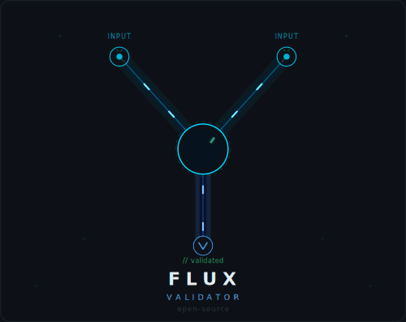

<p align="center">
  
</p>

<p align="center">
  <a href="README.md">DE</a> |
  <a href="README.en.md">EN</a> |
  <a href="README.fr.md">FR</a> |
  <strong>ES</strong> |
  <a href="README.ja.md">JA</a> |
  <a href="README.zh.md">ZH</a>
</p>

# FLUX — Sustrato de Computación Nativo para IA

**FLUX** es una arquitectura de ejecución en la que los sistemas de IA (LLMs) generan grafos de computación en FTL (FLUX Text Language), que son verificados formalmente y compilados a código máquina óptimo.

**El LLM genera texto FTL. El sistema compila a binario. Formalmente verificado. Óptimo.**

## Axiomas de Diseño

```
1. El tiempo de compilación es irrelevante    → Verificación exhaustiva, superoptimización
2. La legibilidad humana es irrelevante       → El LLM trabaja con FTL (texto estructurado),
                                                 el sistema compila a binario
3. Las compensaciones humanas                 → Sin debug, sin manejo de excepciones,
   no son necesarias                            sin programación defensiva
4. El rendimiento de generación de código     → Iteraciones LLM ilimitadas,
   es secundario                                profundidad de análisis ilimitada
5. La creatividad es deseada                  → La IA debe INVENTAR soluciones novedosas,
                                                 no solo reproducir patrones conocidos
6. Pragmatismo en la verificación             → Estrategia de provers escalonada con timeouts,
                                                 indecidible → escalación, no bucles infinitos
```

## Arquitectura

```
Requisito (lenguaje natural, fuera de alcance)
    │
LLM (el programador — reemplaza al humano)
    │  FTL (FLUX Text Language) — texto estructurado
    ▼
Sistema FLUX
    ├─ Compilador FTL (Texto → Binario + hashes BLAKE3)
    ├─ Validador (Estructura + Tipos + Efectos + Regiones)
    │    FALLO → Retroalimentación JSON al LLM (con sugerencias)
    ├─ Prover de Contratos (escalonado: Z3 60s → BMC 5m → Lean)
    │    REFUTADO → Contraejemplo al LLM
    │    INDECIDIBLE → Pista al LLM o incubación
    ├─ Pool / Evolución (para INVENTAR/DESCUBRIR)
    │    Retroalimentación de fitness al LLM (métricas relativas)
    ├─ Superoptimizador (3 niveles: LLVM + MLIR + STOKE)
    │    Caminos calientes óptimos, resto calidad LLVM -O3
    └─ MLIR → LLVM → código máquina nativo
    │
┌───┴────┬──────────┬──────────┐
ARM64   x86-64    RISC-V     WASM
```

## Tipos de Nodos

| Nodo | Función |
|------|---------|
| **C-Node** | Computación pura (ADD, MUL, CONST, ...) |
| **E-Node** | Efecto secundario con exactamente 2 salidas (éxito + fallo) |
| **K-Node** | Flujo de control: Seq, Par, Branch, Loop |
| **V-Node** | Contrato (SMT-LIB2) — DEBE ser probado para la compilación |
| **T-Node** | Tipo: Integer, Float, Struct, Array, Variant, Fn, Opaque |
| **M-Node** | Operación de memoria (ligada a región) |
| **R-Node** | Tiempo de vida de memoria (arena) |


## Principios Fundamentales

**LLM como Programador:** El LLM reemplaza al programador humano. Entrega texto FTL (sin binario, sin hashes). El sistema compila FTL a grafos binarios, calcula hashes BLAKE3 y devuelve retroalimentación JSON.

**Corrección Total:** Cada binario compilado está formalmente verificado. Cero verificaciones en tiempo de ejecución. Los contratos se prueban mediante una estrategia de provers escalonada (Z3 → BMC → Lean).

**Síntesis Exploratoria:** La IA no genera un grafo, sino cientos. La corrección es el filtro, la creatividad es el generador. El algoritmo genético (AG) es el motor principal de innovación; el LLM proporciona la inicialización y las reparaciones dirigidas.

**Superoptimización:** 3 niveles (LLVM -O3 → nivel MLIR → STOKE). Los caminos calientes son mejores que el ensamblador escrito a mano. Realista: 5-20% de mejora general sobre puro LLVM -O3.

**Direccionamiento por Contenido:** Sin nombres de variables. Identidad = hash BLAKE3 del contenido (calculado por el sistema). Misma computación = mismo hash = deduplicación automática.

**Modelo de Mutación Biológica:** Los grafos defectuosos se aíslan en una zona de incubación para desarrollo posterior. Una mutación sobre una mutación puede convertir algo "malo" en algo "especial". Solo el binario final debe ser probadamente correcto — el camino puede pasar por errores.

## Documentación

- **[Especificación FLUX v3](docs/FLUX-v3-SPEC.md)** — Especificación actual (18 secciones)
- **[Especificación FLUX v2](docs/FLUX-v2-SPEC.md)** — Versión anterior (con concesiones humanas)
- **[Análisis de Expertos](docs/ANALYSIS.md)** — Evaluación por 3 agentes especializados (Ronda 2)
- **[Simulación Hello World](docs/SIMULATION-hello-world.md)** — Pipeline desde requisito hasta código máquina
- **[Simulación Snake Game](docs/SIMULATION-snake-game.md)** — Ejemplo complejo con sonido

## Ejemplos

- [`examples/hello-world.flux.json`](examples/hello-world.flux.json) — Hello World (formato JSON v2)
- [`examples/snake-game.flux.json`](examples/snake-game.flux.json) — Snake Game (formato JSON v2)

*Nota: v3 usa FTL (FLUX Text Language) en lugar de JSON. Los ejemplos muestran el formato v2.*

## Tipos de Requisitos

```
TRADUCIR     "Ordenar con mergesort"                  → Síntesis directa (1 grafo)
OPTIMIZAR    "Ordenar lo más rápido posible"           → Selección Pareto (muchas variantes)
INVENTAR     "Mejorar sort(), inventar algo nuevo"     → Síntesis exploratoria + evolución
DESCUBRIR    "Encontrar computación con propiedad X"   → Búsqueda abierta en espacio de grafos
```


## Licencia

MIT

## Agradecimientos
- Bea por el logo
- Gerd por la inspiración
- Michi por los comentarios
